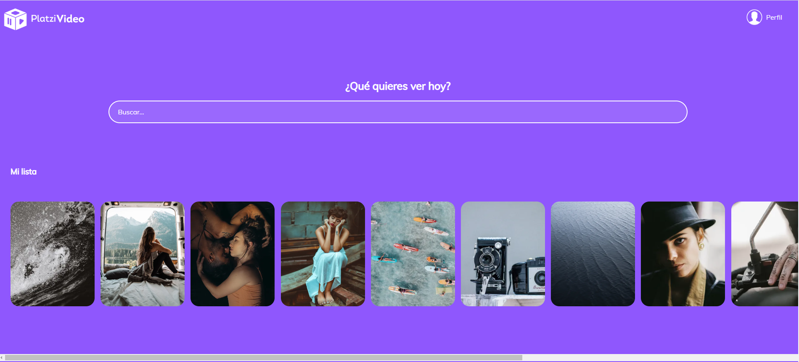

# Frontend-JavaScript project from Platzi

> This is a project from Platzi classes, to beginners on HTML and CSS.

## Built With

- HTML and CSS3

## Live Demo

[Live Demo Link](https://diazgio.github.io/Frontend-EJavaScript/maquetacion-principal.html)

## Getting Started

To get a local copy up and running follow these simple example steps.

- Go to the main page of te repo.
- Press the "Code" button and get the repo link.
- Clone it using git.

## Authors

👤 **Giordano Díaz**

- Github: [@diazgio](https://github.com/diazgio)
- Twitter: [@giordano_diaz](https://twitter.com/giordano_diaz)

## 🤝 Contributing

Contributions, issues and feature requests are welcome!

Feel free to check the [issues page](issues/).

## 📝 License

This project is [MIT](lic.url) licensed.
